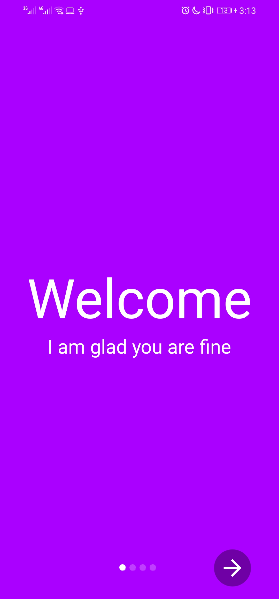
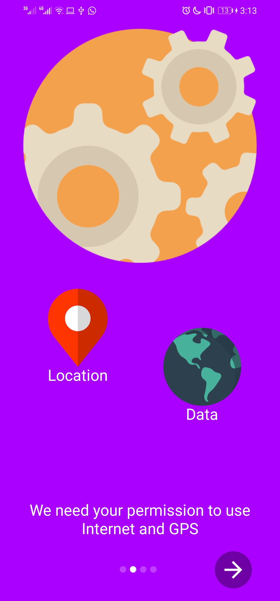
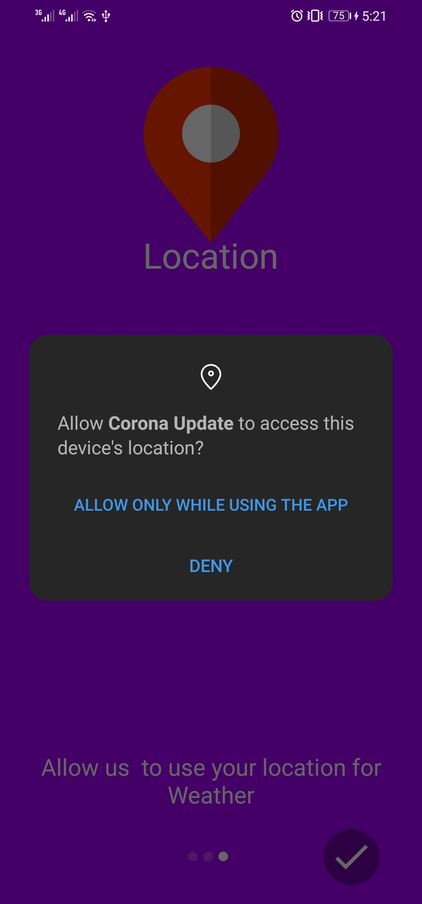
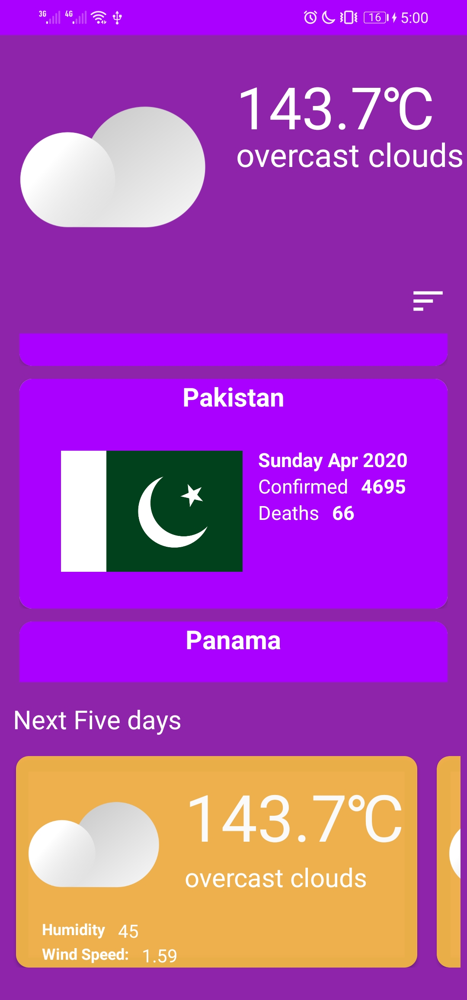

# Corona Update ( Andorid Based Application )

Welcome Screen (One)           |   Welcome Screen (Two)           |   Welcome Screen (Three)          |   Main Screen 
:-----------------------------:|:--------------------------------:|:---------------------------------:|:-------------------------:
 |    |   | 

# Permissions

* [Location Permission](https://developer.android.com/reference/android/Manifest.permission)
* [INTERNET](https://developer.android.com/training/basics/network-ops/connecting)

# Architecture Components Used

*  [Room](https://developer.android.com/topic/libraries/architecture/room)
*  [Live Data ](https://developer.android.com/topic/libraries/architecture/livedata)

# Libraries Used

* [AppIntro](https://github.com/AppIntro/AppIntro).
* [Glide](https://github.com/bumptech/glide).
* [Volley](https://github.com/google/volley).
* [Android-Debug-Database](https://github.com/amitshekhariitbhu/Android-Debug-Database)

 # APIs Used
 * [Open Weather](https://openweathermap.org/).
 * [coronavirus-tracker-api](https://github.com/ExpDev07/coronavirus-tracker-api)
 
 ## Note
  * [coronavirus-tracker-api](https://github.com/ExpDev07/coronavirus-tracker-api) is an opensource community managed API
  so it is more likely to happen that the project might get deleted or may no longer managed by community, So in future this application 
  may not work without this API ( but I will update (if any available) the API ASAP if something happens ). 
  * if every things goes fine app will update after every 12 hours.
  
## About This Application
Idea of this application was originnaly came from a redit user (who created a live Corona update display using an raspberry pi
and a simple LCD which was cool ), he also provided the API that he used for resberry project so thants for that.
And thanks to contributers of [Corona API](https://github.com/ExpDev07/coronavirus-tracker-api).
Well I am a student yet but love to code in spare time, and really love to contribute to open source community :)

Fell Free to report any bugs and contribute, Have a good day.

## License
Application is licensed under The Apache 2.0.
